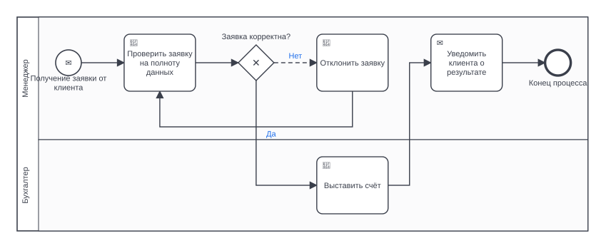

# BPMN Architect

Утилита автоматического построения **BPMN 2.0** диаграмм по текстовому описанию
бизнес-процесса. На вход — обычный текст на русском или английском (или
декларативный DSL), на выход — валидная схема с готовой читаемой компоновкой,
которую можно сразу открыть и править в Camunda Modeler, bpmn.io, Bizagi или
любом другом BPMN-редакторе.

Без внешних зависимостей: только стандартная библиотека Python 3.10+.



## Что делает

| Задача | Как решается |
|---|---|
| Определение элементов процесса | Правиловый разбор с двуязычным словарём маркеров: события начала/конца, задачи (user/service/send/receive/rule/manual/script), промежуточные события (сообщение, таймер, сигнал, ошибка), подпроцессы |
| Определение связей | Блочное промежуточное представление: ветвления и параллелизм — вложенные блоки, поэтому каждому шлюзу-развилке гарантированно соответствует шлюз-слияние |
| Роли и дорожки | Извлечение исполнителя из четырёх синтаксических форм, нормализация и группировка в swimlanes одного пула |
| Циклы и возвраты | Отдельный тип блока «переход»: цель ищется по якорю, номеру шага или нечёткому совпадению с названием элемента |
| Валидность структуры | 15 структурных правил BPMN + диагностика с кодами и уровнями |
| Читаемая компоновка | Послойная (Sugiyama) раскладка: разрыв циклов → ранжирование → минимизация пересечений → точная расстановка координат → ортогональная трассировка связей |
| Пригодность к редактированию | Полная секция BPMN-DI (`BPMNShape`, `BPMNEdge`, `BPMNLabel`) — схема открывается не пустым холстом, а готовым чертежом |

## Установка

```bash
pip install -e .          # из корня репозитория
```

Пакет не тянет зависимостей; `pip install -e ".[dev]"` добавит только
инструменты разработки (pytest, mypy, ruff).

## Быстрый старт

```bash
# схема из текстового описания
bpmn-architect build examples/order_request.ru.txt -o order.bpmn

# сразу все форматы: .bpmn + .svg (предпросмотр) + .json
bpmn-architect build examples/order_request.ru.txt -o out/order -f all

# проверить описание, ничего не записывая
bpmn-architect validate examples/support_ticket.ru.txt

# посмотреть, как именно был понят текст
bpmn-architect explain examples/order_request.ru.txt

# из stdin в stdout
cat описание.txt | bpmn-architect build - --stdout -q > process.bpmn
```

Без установки: `python -m bpmn_architect ...`.

### Пример

Вход (`examples/order_request.ru.txt`):

```text
Обработка заявки клиента

Процесс начинается с получения заявки от клиента.
Менеджер проверяет заявку на полноту данных.
Если заявка корректна, то бухгалтер выставляет счёт, иначе менеджер отклоняет
заявку и заявка возвращается к проверке заявки на полноту данных.
После этого менеджер уведомляет клиента о результате.
Процесс завершается.
```

`bpmn-architect explain` показывает разобранную структуру:

```text
process: Обработка заявки клиента  [ru]
lanes:   Менеджер, Бухгалтер

<start> Получение заявки от клиента (message)
<user> Проверить заявку на полноту данных   [Менеджер]
<xor> Заявка корректна?   [Менеджер]
  case 'Да'
    <user> Выставить счёт   [Бухгалтер]
  case 'Нет' (default)
    <user> Отклонить заявку   [Менеджер]
    <goto> -> 'проверке заявки на полноту данных'
<send> Уведомить клиента о результате   [Менеджер]
<end> Конец процесса   [Менеджер]
```

`bpmn-architect build` даёт из этого два пула-дорожки, шлюз с потоком
по умолчанию, обратный поток доработки и полную геометрию.

## Что понимает парсер

Полная таблица маркеров — в [docs/RECOGNITION.md](docs/RECOGNITION.md). Кратко:

```text
Процесс начинается с ...            → стартовое событие (тип триггера — по тексту)
Процесс завершается ...             → конечное событие
Менеджер проверяет заявку           → задача + дорожка «Менеджер», имя в инфинитиве
Система автоматически формирует акт → service task
Если X, то A, иначе B               → исключающий шлюз, ветки «Да»/«Нет», «Нет» — по умолчанию
Если X:  <отступ> A  Иначе: B       → то же самое блочной записью
Оператор определяет категорию:      → задача «Определить категорию» + шлюз «Категория?»
  - Техническая: ...                   с тремя именованными ветками
Параллельно выполняются A и B       → параллельные шлюзы (развилка и слияние)
После этого ...                     → закрывает ветвление и продолжает основной поток
Заявка возвращается к проверке      → обратный поток к найденному элементу
Менеджер ожидает подтверждения      → промежуточное событие-сообщение
Через 3 дня ...                     → событие-таймер (ISO-8601: P3D)
```

Именование приводится к конвенции BPMN («глагол в инфинитиве + объект»):
*«менеджер проверяет заявку»* → задача **«Проверить заявку»** в дорожке
**«Менеджер»**. Если форма слова неизвестна — текст остаётся как есть
(`--verbatim-names` отключает преобразование полностью).

## DSL: когда нужен точный контроль

Текст удобен, но неоднозначен. Если схема должна получиться строго определённой,
используется блочный DSL — он попадает в тот же конвейер:

```text
process: Согласование счёта
lane: Бухгалтер

start: Счёт получен (message)
task[Бухгалтер]: Проверить счёт @check
xor: Счёт корректен?
  case Да (condition=invoice.valid == true):
    service: Провести оплату
    end: Счёт оплачен
  else Нет:
    send: Запросить исправление
    timer: Ожидание (timer=P3D)
    goto: @check
```

Формат определяется автоматически; `--syntax text|dsl` задаёт его явно.
Полное описание — [docs/DSL.md](docs/DSL.md).

## Python API

```python
from pathlib import Path
from bpmn_architect import generate

result = generate(Path("описание.txt").read_text(encoding="utf-8"))

Path("process.bpmn").write_text(result.to_bpmn(), encoding="utf-8")
Path("preview.svg").write_text(result.to_svg(), encoding="utf-8")

print(result.explain())                      # как понят текст
print(result.diagnostics.format())           # замечания к схеме
print(len(result.model), "элементов")        # доменная модель доступна напрямую
```

Настройка конвейера:

```python
from bpmn_architect.pipeline import PipelineOptions
from bpmn_architect.layout import LayoutMetrics

options = PipelineOptions(strict=True)                  # падать на ошибках валидации
options.build.process_id = "OrderHandling"
options.parser.infinitive_names = False                 # не переписывать формулировки
options.metrics = LayoutMetrics(rank_gap=80, node_gap=50)

result = generate(text, options)
```

## Архитектура

```text
текст ─parsing─▶ IR (блочное дерево) ─building─▶ ProcessModel ─validation─▶ диагностика
                                                      │
                                                      └─layout─▶ геометрия ─rendering─▶ BPMN / SVG / JSON
```

Слои не знают друг о друге ничего, кроме структур на границе:

* `parsing` — два фронтенда (естественный язык и DSL) с общим выходом;
* `domain` — модель BPMN и IR, без единой координаты;
* `building` — сборка графа с гарантией парности шлюзов;
* `validation` — 15 независимых правил-функций;
* `layout` — четыре этапа послойной раскладки, каждый в своём модуле;
* `rendering` — BPMN 2.0 XML + DI, SVG, JSON.

Подробно, с обоснованием алгоритмических решений —
[docs/ARCHITECTURE.md](docs/ARCHITECTURE.md).

## Гарантии результата

* **Валидный BPMN 2.0.** Порядок дочерних элементов соответствует XSD; дорожки
  оборачиваются в `collaboration`/`participant`; поток по умолчанию не несёт
  условия; идентификаторы — корректные NCName.
* **Схема открывается готовой.** Секция DI заполнена целиком: координаты,
  waypoint'ы, подписи, размеры дорожек и пула.
* **Компоновка проверяется тестами, а не на глаз.** Элементы не пересекаются,
  поток идёт слева направо, все сегменты связей строго ортогональны, концы
  связей лежат на границах элементов, элементы не выходят за свою дорожку.
* **Детерминированность.** Одно и то же описание всегда даёт побайтово
  одинаковый файл — диаграмму можно держать в git и смотреть diff.
* **Прослеживаемость.** Каждый элемент несёт исходное предложение в
  `bpmn:documentation` (отключается флагом `--no-documentation`).

## Диагностика

`validate` и `build` печатают замечания с кодами:

| Префикс | Уровень | Значение |
|---|---|---|
| `Exxx` | error | файл структурно неверен: недостижимый элемент, тупик, старт со входящим потоком |
| `Wxxx` | warning | схема валидна, но нарушает конвенцию: безымянная развилка, неявное ветвление на задаче |
| `Ixxx` | info | стоит перечитать, но часто так и задумано |
| `Bxxx` | сборка | решения сборщика: добавлено недостающее событие, не найдена цель перехода |

Код возврата: `0` — ошибок нет, `1` — есть ошибки (или сбой разбора), `2` —
проблема с аргументами или файлом. Флаг `--strict` превращает ошибки валидации
в отказ собирать файл.

## Разработка

```bash
make install   # pip install -e ".[dev]"
make test      # pytest
make lint      # ruff
make types     # mypy --strict
make check     # всё сразу
make examples  # пересобрать docs/images/*.svg из examples/
```

Покрыто тестами: морфология и нормализация текста, оба парсера, сборка графа,
правила валидации, инварианты компоновки, структура BPMN-XML, CLI и устойчивость
к вырожденному вводу (включая пустой файл и обрывки фраз).

## Ограничения

Осознанно не поддерживается в текущей версии:

* развёрнутые подпроцессы (подпроцесс моделируется свёрнутым элементом);
* граничные события на задачах;
* несколько пулов и потоки сообщений между ними;
* исполняемая семантика (формы, слушатели, делегаты Camunda).

Разбор естественного языка — правиловый, а не статистический: он предсказуем и
объясним (`explain` показывает каждое решение), но рассчитан на деловой стиль
описаний. Если формулировка не распознана, элемент всё равно попадёт в схему —
как задача с исходным текстом, а не потеряется.

## Лицензия

MIT — см. [LICENSE](LICENSE).
