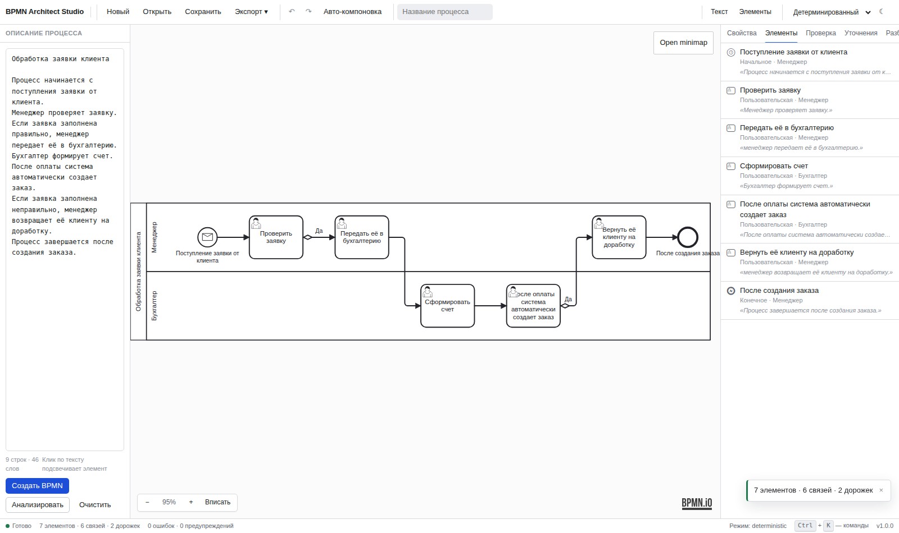

# BPMN Architect Studio

Приложение для построения **BPMN 2.0** диаграмм по текстовому описанию
бизнес-процесса. Вы пишете обычный текст на русском или английском — получаете
валидную схему с готовой читаемой компоновкой и сразу правите её мышкой.

Главное отличие от Camunda Modeler, Bizagi и bpmn.io: работа начинается не с
пустого холста, а с описания процесса словами.



## Что это умеет

1. вставить обычный текст с описанием процесса;
2. нажать **Создать BPMN** — и получить профессиональную схему;
3. править её визуально: перемещать, добавлять, удалять, соединять элементы;
4. менять исполнителей и дорожки;
5. видеть, **из какого предложения** получился каждый элемент, и наоборот;
6. получать уточняющие вопросы там, где описание неоднозначно, — вместо молчаливых догадок;
7. проверять структуру по 15 правилам BPMN с переходом к проблемному элементу;
8. открывать существующие `.bpmn` файлы, в том числе из других редакторов;
9. экспортировать BPMN, SVG, PNG, PDF и JSON;
10. сохранять проект вместе с исходным текстом и возвращаться к нему.

Движок работает и без интерфейса: библиотека и CLI никуда не делись и не
требуют ни одной зависимости.

## Запуск

```bash
pip install -e ".[studio]"
cd frontend && npm install && npm run build && cd ..
bpmn-architect studio
```

Откроется `http://localhost:8000`. Документация API — `/docs`.

Через Docker:

```bash
docker compose up        # http://localhost:8000
```

Подробнее — [docs/DEVELOPMENT.md](docs/DEVELOPMENT.md).

## Пример

Вставьте это в поле описания и нажмите «Создать BPMN»:

```text
Обработка заявки клиента

Процесс начинается с поступления заявки от клиента.
Менеджер проверяет заявку.
Если заявка заполнена правильно, менеджер передает её в бухгалтерию.
Бухгалтер формирует счет.
После оплаты система автоматически создает заказ.
Если заявка заполнена неправильно, менеджер возвращает её клиенту на доработку.
Процесс завершается после создания заказа.
```

Получится: стартовое событие по сообщению → задача менеджера → исключающий шлюз
с ветками «Да» и «Нет» → задачи бухгалтерии → системная задача → конечное
событие, плюс обратный поток доработки, две дорожки по ролям и полностью
расставленная геометрия.

## Архитектура

```
текст ─интерпретация─▶ IR ─сборка─▶ граф ─проверка─▶ диагностика
                                      │
                                      └─компоновка─▶ геометрия ─▶ BPMN 2.0 XML
                                                                      │
                     React + bpmn-js ◀── REST API ◀───────────────────┘
```

| Слой | Ответственность |
|---|---|
| `parsing` | два фронтенда — естественный язык и блочный DSL — с общим выходом |
| `interpreters` | три режима: детерминированный, AI, гибридный |
| `domain` | модель BPMN и промежуточное представление, без единой координаты |
| `building` | сборка графа; парность шлюзов гарантирована конструктивно |
| `validation` | 15 независимых правил-функций |
| `layout` | послойная (Sugiyama) компоновка в четыре этапа |
| `rendering` | BPMN 2.0 XML + DI, SVG, JSON |
| `interop` | чтение чужих BPMN-файлов обратно в модель |
| `analysis` | уточняющие вопросы и обратное описание схемы словами |
| `server` | FastAPI: API и раздача готового SPA |
| `frontend` | React + TypeScript + bpmn-js |

Весь стек обменивается **стандартным BPMN 2.0 XML** — своего промежуточного
формата не существует, поэтому схема в любой момент может уйти в другой
редактор.

Подробно, с обоснованием решений — [docs/ARCHITECTURE.md](docs/ARCHITECTURE.md).

## Режимы интерпретации текста

| Режим | Что делает | Воспроизводимость |
|---|---|---|
| **Детерминированный** | правиловый разбор, без сети и ключей | побайтово одинаковый результат |
| **AI** | модель отвечает на DSL проекта, ответ проверяет настоящий парсер | нет |
| **Гибридный** | разбор правилами; модель — только для неоднозначных мест | да, если модель не понадобилась |

По умолчанию — детерминированный: он единственный пригоден для версионирования
диаграмм в git и сборки в CI. Провайдеры (Claude, OpenAI, локальная модель) —
необязательные пакеты; ядро остаётся без зависимостей.

Подробнее — [docs/TEXT_TO_BPMN.md](docs/TEXT_TO_BPMN.md).

## Командная строка

CLI работает как раньше и не требует ни сервера, ни Node:

```bash
bpmn-architect build процесс.txt -o процесс.bpmn      # схема из описания
bpmn-architect build процесс.txt -o out -f all        # .bpmn + .svg + .json
bpmn-architect validate процесс.txt                   # только проверка
bpmn-architect explain процесс.txt                    # как понят текст
bpmn-architect studio                                 # визуальный редактор
```

## Гарантии результата

* **Валидный BPMN 2.0** — порядок дочерних элементов по XSD, дорожки в
  `collaboration`/`participant`, поток по умолчанию без условия, идентификаторы —
  корректные NCName.
* **Схема открывается готовой** — секция диаграммного обмена заполнена целиком:
  координаты, точки изломов, подписи, размеры дорожек и пула.
* **Компоновка проверяется тестами, а не на глаз** — элементы не пересекаются,
  поток идёт слева направо, все сегменты связей ортогональны, концы связей лежат
  на границах элементов, элементы не выходят за свою дорожку.
* **Детерминированность** — одно описание даёт побайтово одинаковый файл.
* **Прослеживаемость** — каждый элемент несёт исходное предложение, и это же
  связывает текст со схемой в обе стороны.
* **Ничего не додумывается молча** — неоднозначности становятся вопросами.

## Документация

| Файл | О чём |
|---|---|
| [docs/UI.md](docs/UI.md) | интерфейс, панели, горячие клавиши |
| [docs/TEXT_TO_BPMN.md](docs/TEXT_TO_BPMN.md) | как текст превращается в BPMN, режимы, неоднозначности |
| [docs/RECOGNITION.md](docs/RECOGNITION.md) | справочник распознаваемых формулировок |
| [docs/DSL.md](docs/DSL.md) | блочный DSL для точного контроля |
| [docs/API.md](docs/API.md) | HTTP API |
| [docs/ARCHITECTURE.md](docs/ARCHITECTURE.md) | устройство и обоснование решений |
| [docs/EXTENDING.md](docs/EXTENDING.md) | точки расширения |
| [docs/DEVELOPMENT.md](docs/DEVELOPMENT.md) | запуск, сборка, проверки |

## Качество

| Проверка | Состояние |
|---|---|
| Тесты Python | 327 |
| Тесты фронтенда | 30 |
| Сквозной сценарий в браузере | 19 проверок |
| `ruff`, `mypy --strict`, `eslint` | без замечаний |

## Ограничения

Осознанно не реализовано: развёрнутые подпроцессы, граничные события на задачах,
несколько пулов с потоками сообщений между ними, исполняемая семантика Camunda.
Файлы с такими конструкциями **открываются**: неподдерживаемое заменяется
ближайшим элементом с явной диагностикой, а не отбрасывается молча.

## Лицензии

Код проекта — MIT, см. [LICENSE](LICENSE).

Визуальный редактор построен на [bpmn-js](https://bpmn.io) (Camunda Services
GmbH). Его лицензия — MIT с обязательным условием: водяной знак bpmn.io должен
оставаться полностью видимым и не перекрываться. Условие соблюдено, правый
нижний угол холста оставлен свободным намеренно.
