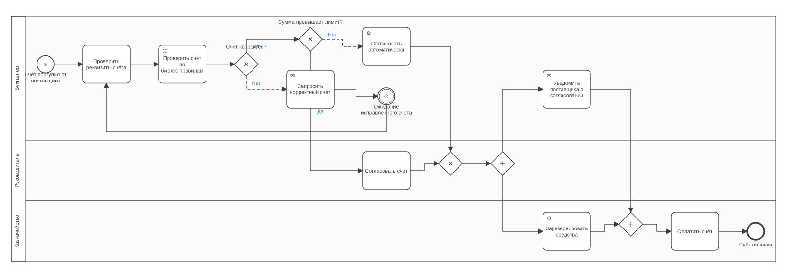

# Блочный DSL

Декларативный формат описания процесса для случаев, когда схема должна
получиться строго определённой: конкретный тип задачи, явное условие на потоке,
именованная точка возврата. DSL попадает в тот же конвейер, что и текст, —
различается только фронтенд разбора.

Формат определяется автоматически. Явно: `--syntax dsl` (тогда синтаксическая
ошибка прерывает сборку) или `--syntax text` (разбирать как обычный текст).

## Общая форма строки

```text
ключевое_слово[исполнитель] аргумент: текст (опции) @якорь
```

Обязательны только ключевое слово и двоеточие. Вложенность задаётся отступом —
два пробела на уровень. Строки, начинающиеся с `#` или `//`, — комментарии.

```text
task[Менеджер]: Проверить заявку (id=CheckRequest) @check
└─┬─┘└───┬───┘  └──────┬───────┘ └─────┬──────┘  └──┬─┘
  │      │             │                │           └─ якорь для goto
  │      │             │                └───────────── опции
  │      │             └────────────────────────────── название элемента
  │      └──────────────────────────────────────────── исполнитель → дорожка
  └─────────────────────────────────────────────────── тип элемента
```

## Заголовок

| Директива | Назначение |
|---|---|
| `process:` / `процесс:` | название процесса |
| `id:` | идентификатор `bpmn:process` |
| `lane:` / `дорожка:` / `роль:` | объявляет дорожку и фиксирует её порядок |
| `doc:` / `описание:` | описание процесса |
| `language:` / `язык:` | язык (`ru` / `en`), если автоопределение ошибается |

Дорожки можно не объявлять — они появятся сами из указанных исполнителей.
Явное объявление нужно, чтобы задать **порядок** дорожек сверху вниз.

## Задачи

| Ключевое слово | Элемент BPMN |
|---|---|
| `task` / `задача` | `task` |
| `user` / `пользователь` | `userTask` |
| `service` / `сервис` / `система` | `serviceTask` |
| `manual` / `вручную` | `manualTask` |
| `script` / `скрипт` | `scriptTask` |
| `send` / `отправить` | `sendTask` |
| `receive` / `получить` | `receiveTask` |
| `rule` / `правило` | `businessRuleTask` |
| `subprocess` / `подпроцесс` | `subProcess` (свёрнутый) |
| `call` / `вызов` | `callActivity` |

## События

| Ключевое слово | Элемент BPMN |
|---|---|
| `start` / `начало` | стартовое событие |
| `end` / `конец` | конечное событие |
| `catch` | промежуточное принимающее |
| `wait` / `ожидание` / `message` / `сообщение` | промежуточное событие-сообщение |
| `timer` / `таймер` | событие-таймер |
| `throw` | промежуточное генерирующее |
| `signal` / `сигнал` | генерирующее событие-сигнал |

Тип триггера задаётся опцией: `(message)`, `(timer=P3D)`, `(error)`,
`(signal)`, `(escalation)`, `(terminate)`, `(conditional)`.

```text
start: Заявка получена (message)
timer: Ожидание оплаты (timer=P3D)
end: Аварийное завершение (terminate)
```

Значение таймера пишется как ISO-8601 (`P3D`, `PT2H`, `P1W`). Повторяющиеся
выражения (`ежедневно`, `daily`) выгружаются как `timeCycle`, остальные — как
`timeDuration`.

## Ветвления

```text
xor: Счёт корректен?
  case Да (condition=invoice.valid == true):
    service: Провести оплату
  else Нет:
    task: Запросить исправление
```

| Ключевое слово | Шлюз |
|---|---|
| `xor` / `if` / `если` / `выбор` | `exclusiveGateway` |
| `or` / `inclusive` / `или` | `inclusiveGateway` |
| `event-gateway` / `событие-выбор` | `eventBasedGateway` |

Внутри блока допустимы только `case` (`вариант`, `ветвь`) и `else` (`default`,
`иначе`). Текст после `case` до двоеточия — метка потока; `else` помечает поток
как **поток по умолчанию** (`default` на шлюзе, без условия — как требует
спецификация). Опция `condition=` кладёт выражение в `conditionExpression`.

Тело ветки — вложенные строки; короткую ветку можно записать в одну строку:

```text
xor: Заявка корректна?
  case Да: Выставить счёт
  else Нет: Отклонить заявку
```

## Параллелизм

```text
and:
  branch:
    service[Казначейство]: Зарезервировать средства
  branch:
    send[Бухгалтер]: Уведомить поставщика
```

`and` (`parallel`, `параллельно`) принимает только блоки `branch` (`ветка`,
`поток`), минимум два. Развилка и слияние создаются автоматически.

## Переходы и циклы

```text
task[Бухгалтер]: Проверить счёт @check
...
goto: @check
```

`goto` (`loop`, `переход`, `возврат`) принимает якорь (`@имя`), номер шага
(`шаг 2`, `step 2`) или текст, который сопоставляется с названиями элементов по
словарным основам. Неразрешённый переход не прерывает сборку: он сообщается
кодом `B201`, а оставшийся открытым путь закрывается конечным событием.

## Опции

Записываются в скобках через запятую, `ключ=значение` или просто флаг.

| Опция | Где применима | Значение |
|---|---|---|
| `condition=<выражение>` | `case` | условие на исходящем потоке |
| `timer=<ISO-8601>` | события | значение таймера |
| `message`, `signal`, `error`, `escalation`, `terminate`, `conditional` | события | тип триггера |

## Диагностика ошибок

Синтаксическая ошибка сообщает номер строки и её текст:

```text
error: unknown directive 'нонсенс' (line 7): 'нонсенс: что-то'
```

Проверяется и семантика блоков: шлюз без единого `case`, блок `and` с одной
веткой, `case` вне шлюза.

## Полный пример

См. [`examples/invoice_approval.dsl`](../examples/invoice_approval.dsl) —
вложенные шлюзы, параллельный блок, событие-таймер, возврат по якорю и три
дорожки.


