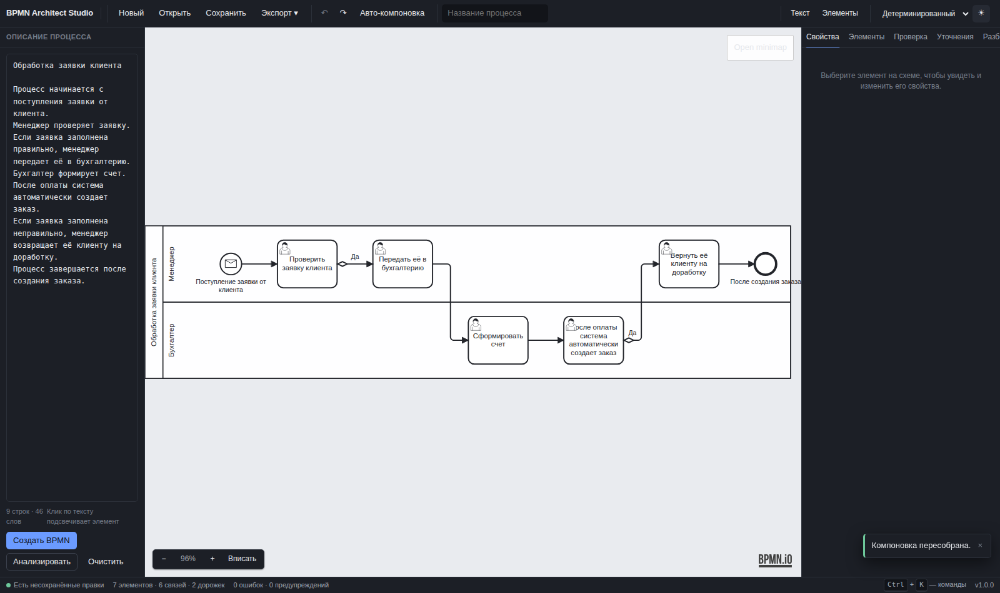

# Интерфейс


Интерфейс собран как инструмент разработчика, а не как посадочная страница:
плотная типографика, тонкие границы, один сдержанный акцентный цвет, никаких
градиентов. Всё, что не является диаграммой, намеренно приглушено — смотреть
пользователь пришёл на диаграмму.

## Раскладка

```
┌──────────────────────────────────────────────────────────────────┐
│ BPMN Architect Studio   Новый Открыть Сохранить Экспорт  ↶ ↷     │
├───────────────┬────────────────────────────┬─────────────────────┤
│ Описание      │                            │ Свойства            │
│ процесса      │          ХОЛСТ             │ Элементы            │
│      или      │                            │ Проверка            │
│ Элементы BPMN │                            │ Уточнения           │
│               │                            │ Разбор              │
├───────────────┴────────────────────────────┴─────────────────────┤
│ Готово · 7 элементов · 6 связей · 0 ошибок      Ctrl+K — команды │
└──────────────────────────────────────────────────────────────────┘
```

Левая колонка переключается между двумя режимами работы — **Текст** (описание
процесса) и **Элементы** (палитра BPMN). Это два разных занятия: сначала текст,
потом правка руками, и держать оба инструмента одновременно незачем.

## Левая колонка

### Текст

Большое поле для описания процесса и три действия:

| Кнопка | Что делает |
|---|---|
| **Создать BPMN** | полный конвейер: разбор → граф → проверка → компоновка |
| **Анализировать** | только разбор: показывает, как понят текст, ничего не строя |
| **Очистить** | сбрасывает описание и диаграмму |

Под полем — счётчик строк и слов. Черновик сохраняется в браузере, поэтому
случайно закрытая вкладка не уносит с собой текст.

### Элементы BPMN

Палитра: инструменты холста (перемещение, рамка выделения, раздвинуть место,
соединение) и полный набор элементов — события, задачи, шлюзы, пул.
Перетаскивание запускает штатную операцию создания bpmn-js, поэтому элемент,
брошенный отсюда, подчиняется тем же правилам моделирования и попадает в ту
дорожку, над которой отпущен.

## Холст

Полноценный BPMN-редактор: выделение и множественное выделение, перетаскивание,
изменение размеров, соединение элементов, контекстная панель, undo/redo,
копирование и вставка, миникарта.

* масштаб — панель слева внизу;
* миникарта — правый верхний угол, свёрнута по умолчанию;
* прогресс построения показывается только по фактически завершённым этапам.

Правый нижний угол холста оставлен свободным: там водяной знак bpmn.io,
который по условиям лицензии должен оставаться полностью видимым.

## Правая колонка

| Вкладка | Содержание |
|---|---|
| **Свойства** | все поля выбранного элемента; каждое изменение идёт через модель |
| **Элементы** | список распознанного: элемент, роль, исходное предложение |
| **Проверка** | результаты 15 правил; клик по замечанию ведёт к элементу |
| **Уточнения** | вопросы там, где описание было неоднозначным |
| **Разбор** | как понят текст, и обратное описание схемы словами |

### Свойства

Поля сгруппированы так же, как их держит в голове аналитик:

* **Основное** — название, тип, идентификатор, документация;
* **Исполнитель** — дорожка (перемещает элемент в другую дорожку по-настоящему);
* **Событие** — тип триггера, значение таймера;
* **Поток** — условие; для потока по умолчанию поле заблокировано, потому что
  спецификация BPMN запрещает на нём условие;
* **Шлюз** — какой из исходящих потоков считается потоком по умолчанию;
* **Связи** — входящие и исходящие, каждая кликабельна.

Ни одно поле не является «оверлеем» поверх диаграммы: правка попадает в модель,
ложится в стек отмены и уходит на сервер при следующей синхронизации.

## Двусторонняя связь текста и схемы

Ключевая особенность продукта.

* **Текст → схема.** Поставьте курсор в предложение — элементы, которые из него
  получились, подсветятся на холсте.
* **Схема → текст.** Выберите элемент — соответствующее предложение выделится в
  описании и прокрутится в зону видимости.

Обе стороны читают одну и ту же карту соответствий (`sourceMap`), поэтому
разойтись они не могут. Для элементов, добавленных вручную, соответствия нет —
это видно сразу, и это честно.

## Горячие клавиши

| Сочетание | Действие |
|---|---|
| `Ctrl` + `K` | палитра команд — доступ ко всему с клавиатуры |
| `Ctrl` + `Enter` | создать BPMN из текста |
| `Ctrl` + `L` | пересобрать компоновку |
| `Ctrl` + `0` | вписать в экран |
| `Ctrl` + `+` / `−` | масштаб |
| `Ctrl` + `Z` / `Ctrl` + `Shift` + `Z` | отменить / повторить |
| `Ctrl` + `C` / `Ctrl` + `V` | копировать / вставить |
| `Delete` | удалить выбранное |

Правки холста (отмена, удаление, копирование) обрабатывает сам bpmn-js — он
знает, когда фокус на холсте, и не срабатывает во время набора текста.

## Темы

Светлая и тёмная, переключатель в правом верхнем углу; выбор запоминается, а при
первом открытии берётся системная настройка.



В тёмной теме интерфейс тёмный, а холст остаётся светлым «листом». Это
осознанное решение: диаграмма — документ, и собственные соглашения BPMN
(чёрные линии по белому, маркеры, водяной знак) рассчитаны на светлый фон.
Так же поступают Camunda Modeler и Figma.

## Уведомления и статус

Сообщения появляются в правом нижнем углу: успех и информация исчезают сами,
ошибки остаются до закрытия. Строка состояния всегда показывает состояние
документа, число элементов, ошибок и предупреждений, текущий режим
интерпретации и выбранный элемент.
